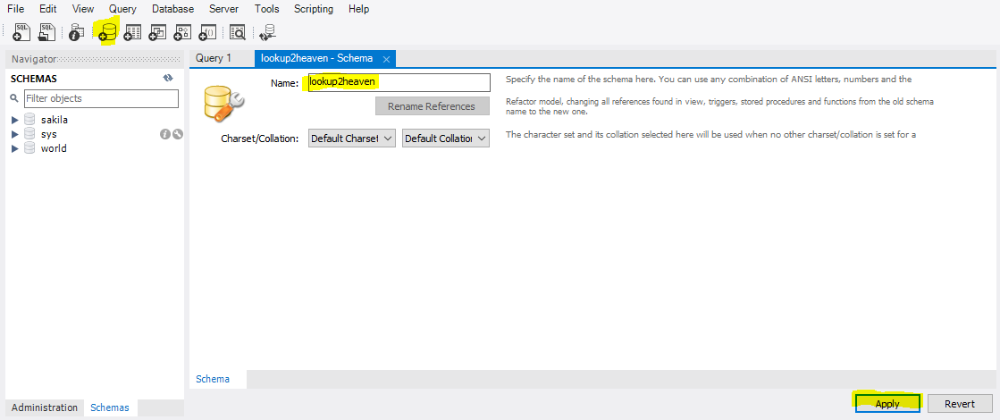

# Lookup (to) Heaven!

> A website for all your ceremonial duty needs! Bible verses and a community tab are complementary!

## 💻 Prerequisites

Before cloning, remember to have the following:

- The latest version of MySQL Community Workbench installed.
- The latest version of XAMMP installed.

## 🚀 Installing Lookup2Heaven

To install Lookup2Heaven, follow these steps:

- Create a schema on your workbench called "lookup2heaven".

<i>(Setting up the schema)</i>

<i>(Running the schema creation code)</i>

<i>(Schema created succesfully and is already listed)</i>

- That's all! The program will do the rest (create tables, etc) for you!

## ☕ Running Lookup2Heaven

To run Lookup2Heaven, make sure to:

- Run your copy of XAMMP.
- Connect to MySQL through XAMMP (make sure it is running on PORT 3306!)  

   
  
- Run your copy of MySQL workbench.
- Start your MySQL connection using the workbench.
- Run "npm start" in your terminal.

## 📝 License

This project is licensed. View the [LICENSE](LICENSE.txt) file for details.